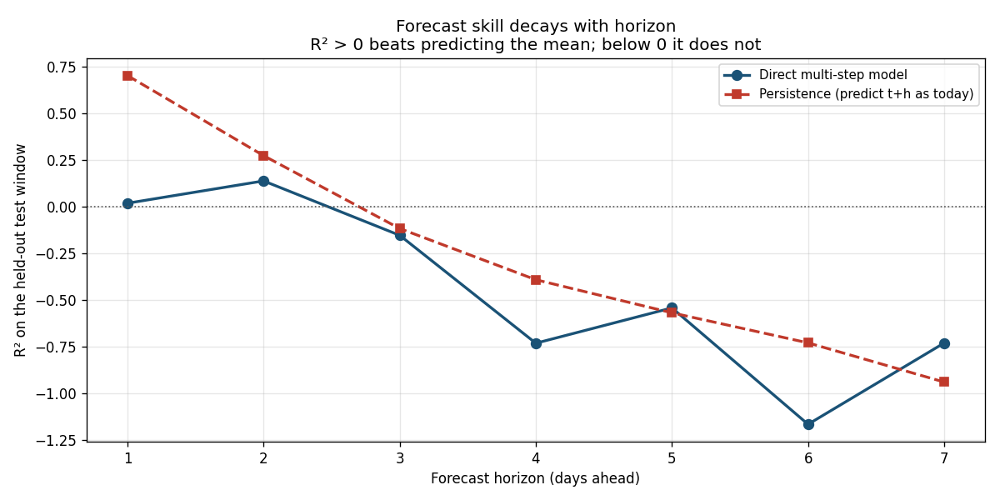

# Air Quality Prediction Service

**PM2.5 forecasts for Olivais, Lisboa, Portugal**
Sensor: [AQICN station 10513](https://aqicn.org/station/portugal/lisboa/olivais/) · 38.7689 °N, −9.1081 °E

A serverless ML system that forecasts fine-particulate pollution for the next 7
days. Weather forecasts come from [Open-Meteo](https://open-meteo.com), air
quality measurements from [AQICN](https://aqicn.org), features are stored in
[Hopsworks](https://www.hopsworks.ai), and the pipelines run daily on GitHub
Actions.



## 7-Day PM2.5 Forecast — all sensors in Lisboa

Forecasts for all three AQICN stations in the Lisboa area — Olivais (10513),
Entrecampos (8379) and Laranjeiro, Almada (8381) — from a single XGBoost model
trained on 10,093 daily observations. The station enters the model as a
categorical feature, so one model learns each site's characteristic offset
while sharing the signal common to all of them.

Forecasts use **direct multi-step** models — one per horizon, each predicting
from measured features only, so no prediction is ever fed back in as an input.

> **How much to trust these:** not very much, and the chart below says why.
> On the held-out test window this model scores R² ≈ +0.02 one day ahead and
> falls below zero from day three, meaning it does not beat simply predicting
> the long-run average. A plain "tomorrow will be like today" baseline
> outperforms it at every short horizon. This is reported rather than hidden:
> daily PM2.5 at these stations is not well predicted by daily weather.

## How far ahead is this useful?

R² above zero beats predicting the mean; below zero it does not. The
persistence line — "predict t+h as today's value" — beats the trained model at
almost every horizon, which locates the real signal: PM2.5 is autocorrelated,
and that autocorrelation is nearly all the predictability available here.

### Single-sensor forecast (Olivais)

## Effect of lagged features

Adding PM2.5 from 1, 2 and 3 days earlier cut test MSE by 74.5% (222.15 → 56.73)
and moved R² from −0.904 to +0.514. PM2.5 is strongly autocorrelated — +0.68
with the previous day — and weather features alone cannot express that. Notably,
a plain persistence baseline ("today equals yesterday") still scores better
than the model at MSE 45.66.

## Model Performance Monitoring

1-Day Hindcast: predictions vs measured outcomes

Every forecast is written to a monitoring feature group alongside the horizon it
was made at, so predictions can be compared against the outcomes that arrive
later. The chart above shows only forecasts made one day ahead.

---

*Built for ID2223 (Scalable Machine Learning and Deep Learning), KTH.
[Source code](https://github.com/margaridagsousa/Lab1mlfs-book).*
