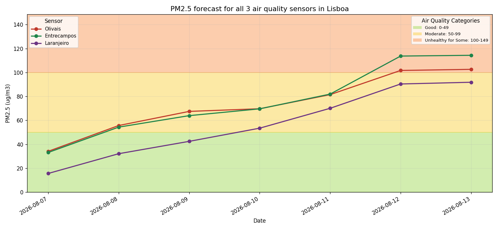
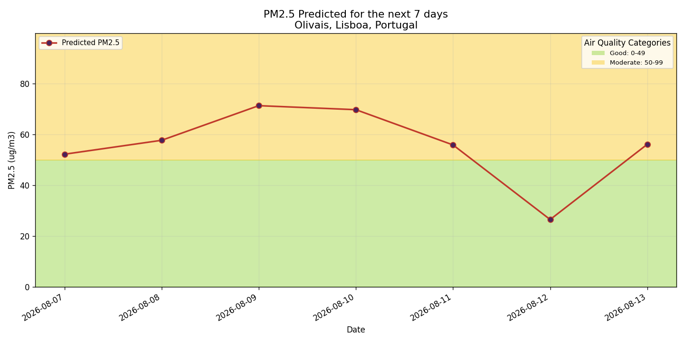
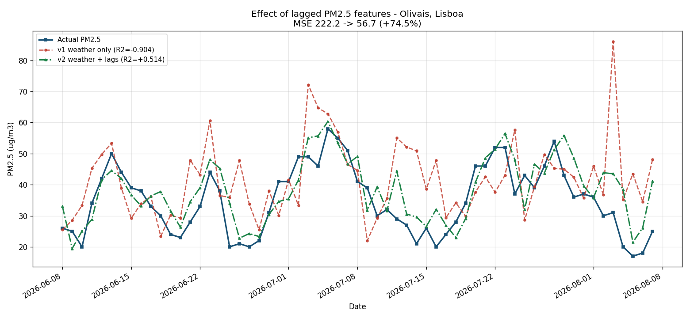
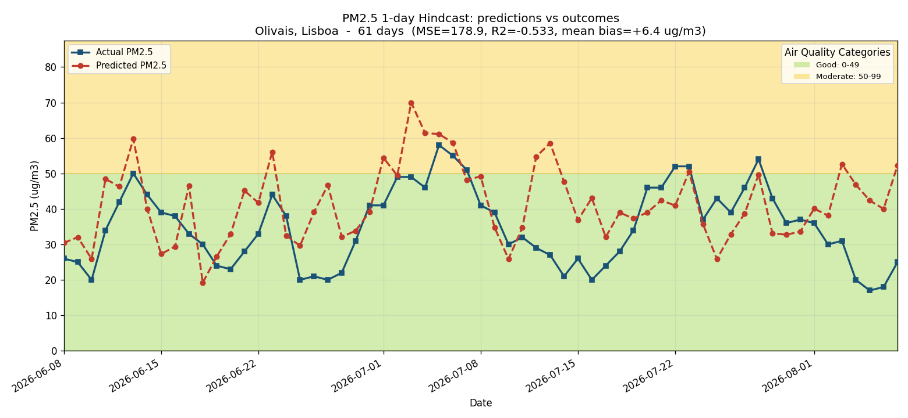

# Air Quality Prediction Service

**PM2.5 forecasts for Olivais, Lisboa, Portugal**
Sensor: [AQICN station 10513](https://aqicn.org/station/portugal/lisboa/olivais/) · 38.7689 °N, −9.1081 °E

A serverless ML system that forecasts fine-particulate pollution for the next 7
days. Weather forecasts come from [Open-Meteo](https://open-meteo.com), air
quality measurements from [AQICN](https://aqicn.org), features are stored in
[Hopsworks](https://www.hopsworks.ai), and the pipelines run daily on GitHub
Actions.



## 7-Day PM2.5 Forecast — all sensors in Lisboa

Forecasts for all three AQICN stations in the Lisboa area — Olivais (10513),
Entrecampos (8379) and Laranjeiro, Almada (8381) — from a single XGBoost model
trained on 10,093 daily observations. The station enters the model as a
categorical feature, so one model learns each site's characteristic offset
while sharing the signal common to all of them.

> **Reading these forecasts:** only the day-1 prediction uses measured inputs.
> Later days feed the model's own predictions back in as lagged features, so
> bias compounds and the upward trend beyond ~3 days is an artifact of that
> feedback rather than a genuine air-quality warning. The hindcast below
> measures day-1 accuracy, which is the horizon to trust.

### Single-sensor forecast (Olivais)

## Effect of lagged features

Adding PM2.5 from 1, 2 and 3 days earlier cut test MSE by 74.5% (222.15 → 56.73)
and moved R² from −0.904 to +0.514. PM2.5 is strongly autocorrelated — +0.68
with the previous day — and weather features alone cannot express that. Notably,
a plain persistence baseline ("today equals yesterday") still scores better
than the model at MSE 45.66.

## Model Performance Monitoring

1-Day Hindcast: predictions vs measured outcomes

Every forecast is written to a monitoring feature group alongside the horizon it
was made at, so predictions can be compared against the outcomes that arrive
later. The chart above shows only forecasts made one day ahead.

---

*Built for ID2223 (Scalable Machine Learning and Deep Learning), KTH.
[Source code](https://github.com/margaridagsousa/Lab1mlfs-book).*
